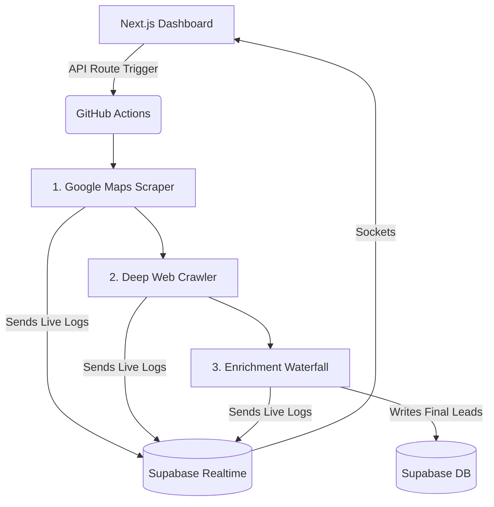

# 🤖 LeadEngine Pro

LeadEngine Pro is a backend-heavy, highly automated B2B lead generation SaaS. It allows users to search for niche businesses (e.g., "Auto Spares Manufacturers in Karachi"), scrubs the web for their details, extracts decision-maker emails using a waterfall of APIs, and presents them in a premium UI.

## 🏗️ How the Architecture Works

LeadEngine Pro separates the "Frontend Dashboard" from the "Heavy Lifting Automation". 



### 1. The Trigger
When you click **"Start Campaign"** in the web dashboard, it hits the Next.js API `/api/scrape`. Instead of running scrapers on the web server (which would timeout or crash it), the API sends a `repository_dispatch` trigger to **GitHub Actions**.

### 2. The 3-Step Pipeline (GitHub Actions)
GitHub spins up a heavy-duty cloud server and runs three scripts sequentially:

* **Step 1: Scraper (`scripts/scraper.js`)**
  Uses `playwright-extra` with stealth evasion to open Google Maps. It searches your niche, scrolls through results, and extracts the Company Name, Address, Phone, and Website.
* **Step 2: Crawler (`scripts/crawler.js`)**
  Visits the actual website of every lead found. It checks the homepage and `/contact` page. It uses regex to find emails, phone numbers, and WhatsApp numbers, and uses basic signatures to detect their Tech Stack (e.g., Shopify, WordPress).
* **Step 3: Enrichment (`scripts/enrich.js`)**
  If the crawler couldn't find an email (or to verify the one it did), it runs a "Waterfall." It asks **Bouncify** (to verify email validity), then **Apollo.io**, **ContactOut**, and **Hunter.io** one by one until it finds a valid decision-maker email using the company's domain.

### 3. The Real-time Terminal Link
While GitHub Actions is crawling the web, it uses a custom `logger.js`. Every time it finds a lead or logs an event, it writes a message to the `job_logs` table in Supabase. Your Next.js dashboard is subscribed to this table via WebSockets (Supabase Realtime), creating a live "hacker-style" terminal UI on your screen.

---

## 🚀 How to Run the Project

Since the project uses Next.js, Supabase, and GitHub Actions, there are a few moving parts.

### Step 1: Start the Local Dashboard
You already have this running on your PC. To start it at any time:
1. Open PowerShell or Terminal.
2. Navigate to the project: `cd C:\Users\murta\Desktop\scraping`
3. Install dependencies: `npm install`
4. Start the frontend: `npm run dev`
5. Go to `http://localhost:3000` in your browser.

### Step 2: Supabase Setup (Database)
The project relies on Supabase to store leads and handle logins.
1. Make sure your `.env.local` contains all the Supabase URLs and Keys (copy them from `.env.example`).
2. To push your schema to the Supabase database, run:
   ```bash
   npx prisma migrate dev --name init
   ```
   *(This creates the `User`, `Lead`, `ScrapeJob`, etc. tables natively based on your `schema.prisma`)*

### Step 3: Run a Scraping Campaign
You can trigger a scrape directly from your local dashboard!

1. Go to the **New Campaign** page on `localhost:3000`.
2. Enter a niche (e.g., "Auto Spares") and location (e.g., "Karachi").
3. Click Start.
4. If your `GITHUB_TOKEN` in `.env.local` is correct (and has `workflow` permissions), it will send a signal to GitHub.
5. Open your GitHub Repository in your browser and go to the **Actions** tab. You'll see the heavy scraper spinning up!
6. Go back to your local dashboard — you should see the live terminal updating as the GitHub Action logs its work.

### Step 4: Making the Scraper Work on GitHub
For GitHub to be able to talk to Supabase and your API keys, it needs to know your passwords.
1. Go to your [GitHub Repository](https://github.com/salersops-gif/shavezs-scraper).
2. Go to **Settings** > **Secrets and variables** > **Actions** > **New repository secret**.
3. Add the following secrets by copying them from your `.env.local`:
   * `SUPABASE_URL`
   * `SUPABASE_SERVICE_KEY`
   * `BOUNCIFY_API_KEY`
   * `APOLLO_API_KEY`
   * `CONTACTOUT_API_KEY`
   * `HUNTER_API_KEY`

Once these are entered, the GitHub Action will have all the permissions it needs to enrich leads and save them directly to your Supabase database!
